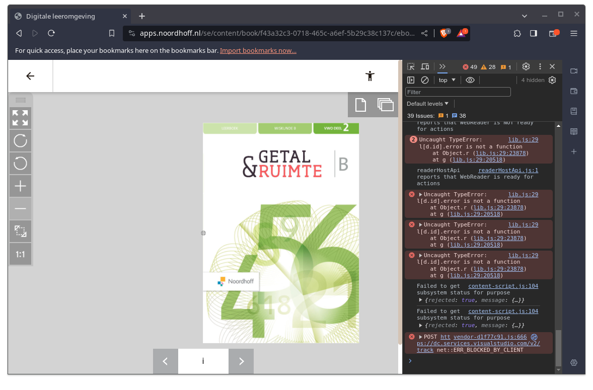
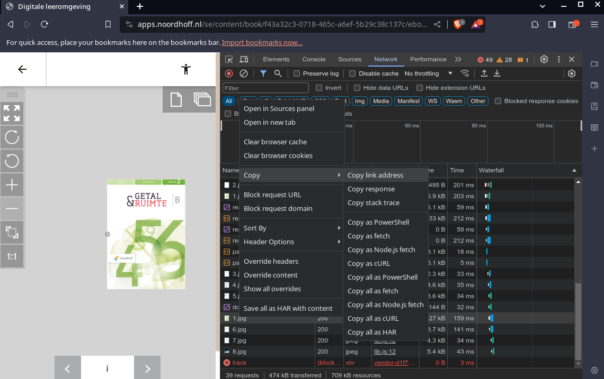

# noordhoff.py

# This is still on github only for archival purposes

Creates PDF files from jpgs downloaded from Noordhoff.

Noordhoff is a dutch company that creates school books. They require you to use a terrible javascript infested website to read their books online. The pages are individually loaded as a simple jpg. Somehow these aren't secured. Child's play.

You'll need the ['img2pdf'](https://github.com/josch/img2pdf) and the ['requests'](https://github.com/psf/requests) libraries. Use the nix-shell environment included in the repo, a [python virtual environment](https://docs.python.org/3/library/venv.html) or the packages provided by your distro.

You will need to parse a single argument into the program. This `link` has to be a link to one of page's jpgs.

## Optional Arguments
* `-v`/`--verbose` - Lists each image being downloaded individually.
* `-o`/`--output` - Renames the outputted PDF to the given name.

## How to get this link?
1. You will need to have access to the online book. There might be a way around, but I'm too lazy to figure that out lol.
For this example I will use `Getal en Ruimte. Wiskunde B. Deel 2`. The link to that one is ```https://apps.noordhoff.nl/se/content/book/f43a32c3-0718-465c-a6ef-5b29c38c137c/ebooks/fccac6af-9e6a-4155-9f13-d9ed7501371d```.
2. Once on the webpage, open the developer tools. This can be done by pressing F12 or function+F12 on your keyboard. It might look different on your screen but that should be no problem. Go to the `Network` tab of the window that pops up. If you don't see the tab, click on the `>>` and select `Network`.
3. You should be able to see some .jpg files in the developer tools. Right click one of them, which one doesn't matter. Hover over `Copy`. Then select `Copy link address`. This is the link you wanna parse into the program.
4. The link should look something like this:
```
https://cdp.contentdelivery.nu/f5c5e97e-5f64-4da4-a3dd-d99154e8338d/20221004094415/extract/assets/img/layout/1.jpg
```
The numbers/letters are different depending on which book you're downloading.

There are 2 images below to help you.

## Images
*Open the developer tools*  
  
*Copy the required data*  



# noordhoff_json.py
For mass downloading files.

Quick and dirty modification of `noordhoff.py` to automate it.

It requires a file called `noordhoff.json`. There's an example [here](noordhoff.json). If you're using this program, you should be able to figure out the rest.
